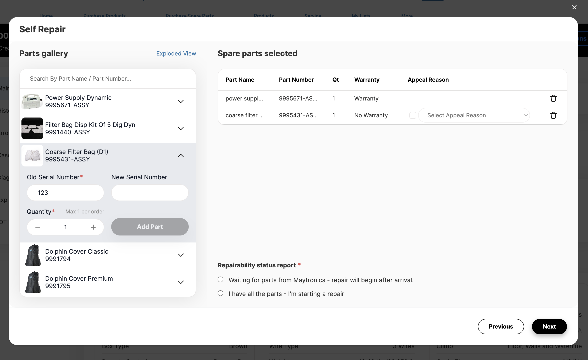

# Пример кода

Это WIP задача, которая представляет собой UI для составения заказа на запчасти робота.
Компонент встроен в Screen Flow и использует extended lightning-datatable для отображения информации.

Основной функционал представлен здесь:
- `B2BExposeSNSparePartsService.cls`
- `b2bSparePartsGallery` (LWC bundle)
